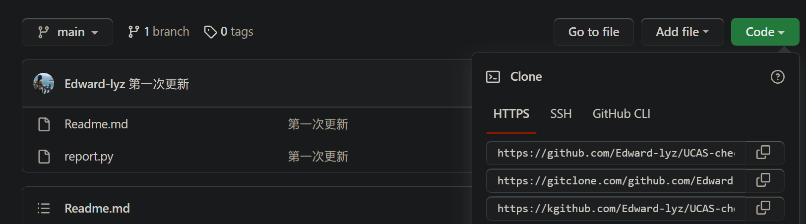
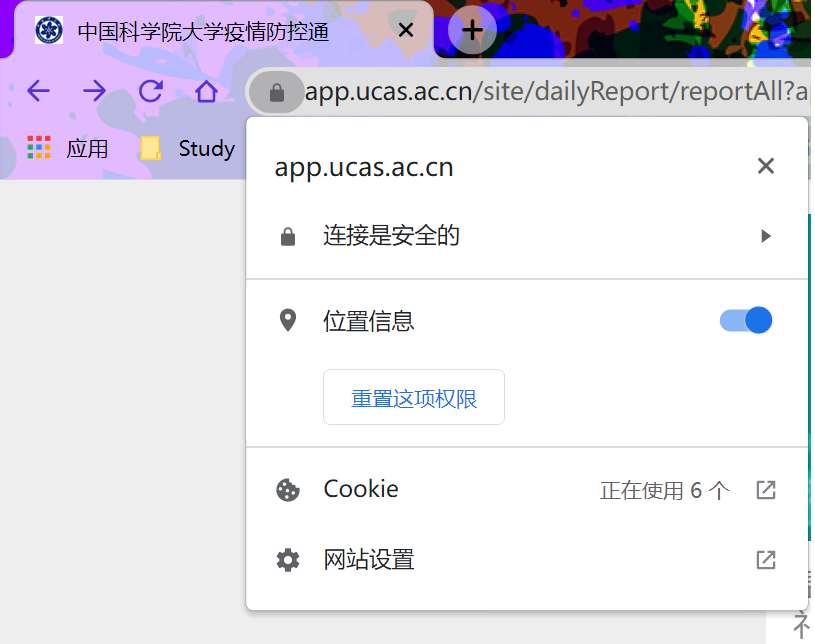
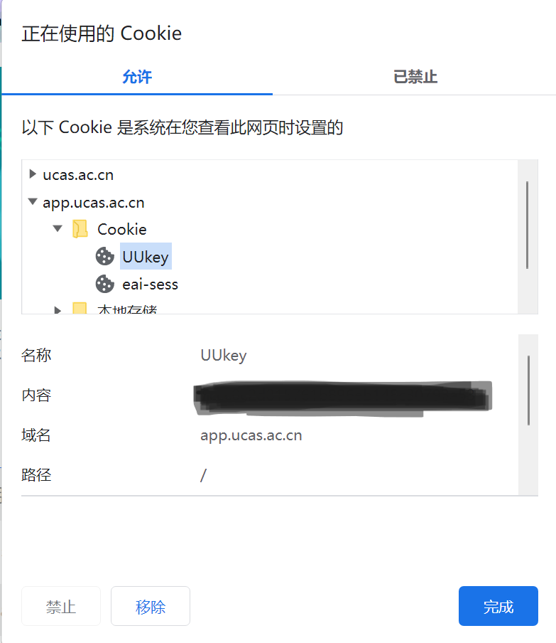
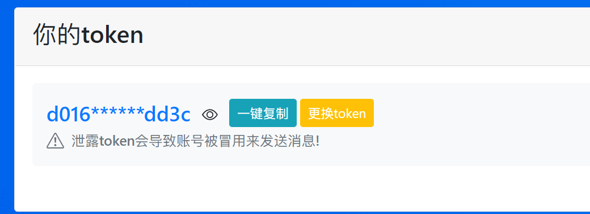

# UCAS 每日疫情打卡自动化助手

## 所需环境：

- python3
- requests(安装指令：`pip install requests`)
- pushplus注册(后文会讲)

## Step 1：下载本仓库源码



## Step 2: 获取所需cookie

- [登录此网站](https://app.ucas.ac.cn/site/dailyReport/reportAll?appid=9)

- 点开chrome左上角的小锁图标，找到cookie

  

- 找到UUkey和eai-sess的值：



- 获取pushplus的token：首先注册登录（也就是微信扫码关注就行），其次打开 [该网页](https://www.pushplus.plus/push1.html)，复制粘贴你的token，如图：

  

## Step 3 修改report.py 文件中的个人信息

- 修改你的realname，number，也就是你的姓名、学号
- 修改UUkey和eai-sess的值
- 修改pushplus的token

## Step 4 运行py文件，查看微信消息推送结果

```
python report.py
```

## 进阶技巧：

- 有服务器的同学可以利用crontab每日定时打开
- 有路由器（openwrt）的同学也可以设置定时任务

## 最后声明：

本代码只用于个人使用，严禁转卖、倒卖，若使用有问题可以提issue